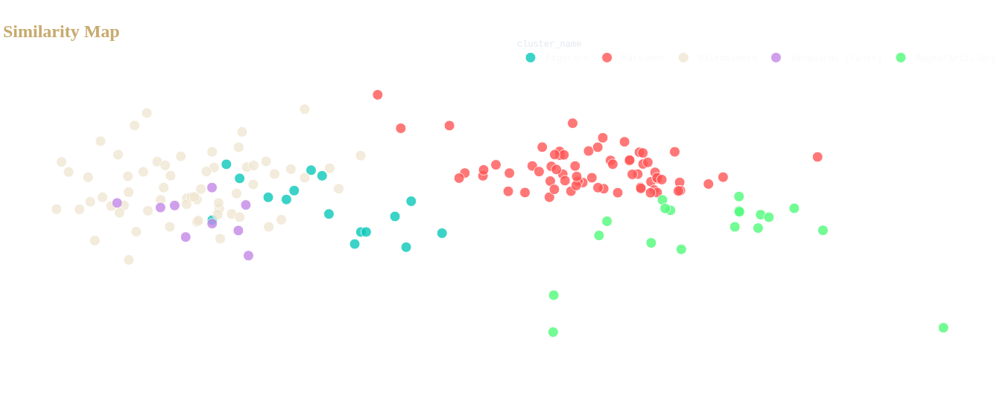

# League of Legends: Data Science & ML Hub


## Project Information

### Authors
* **[Francisco Solís Pedraza](https://github.com/francis4all)** - *Lead Developer & Data Scientist*

### Affiliations
* **Bachelor's in Information Technologies for Science**
* Escuela Nacional de Estudios Superiores (ENES), Unit Morelia
* National Autonomous University of Mexico (UNAM)

### Contact Information
* Email: [fran.sp.datasci@gmail.com]
* LinkedIn: [[linkedin.com/in/francisco-solis-ds](https://www.linkedin.com/in/francisco-solis-ds/)]
### License
This project is licensed under the MIT License - see the [LICENSE](LICENSE) file for details.

---

## Introduction
This project implements a **Dockerized Microservices Architecture** for the massive analysis of *League of Legends* game data. The main objective is to apply **Unsupervised Machine Learning** techniques to discover hidden patterns in champion combat statistics, redefining traditional game roles through mathematical clustering.

The platform consists of a Backend (REST API) that processes the data and an interactive Frontend that visualizes the findings in real-time.

## Installation and Execution

This project utilizes **Docker**, so manual installation of Python or libraries is not required.

### Prerequisites
* [Git](https://git-scm.com/)
* [Docker Desktop](https://www.docker.com/products/docker-desktop/)

### Steps
1.  **Clone the repository:**
    ```bash
    git clone [https://github.com/francis4all/riot-ml-microservice](https://github.com/francis4all/riot-ml-microservice)
    cd riot-ml-microservice
    ```

2.  **Build and start the containers:**
    ```bash
    docker compose up --build
    ```

3.  **Access the application:**
    *  **Frontend (Dashboard):** [http://localhost:8501](http://localhost:8501)
    *  **Backend (API):** [http://localhost:8000/champions/](http://localhost:8000/champions/)

---

## Methodology

The Data Science workflow follows the standard pipeline:

1.  **Data Ingestion:** Consumption of the official Riot Games API (DataDragon) to obtain base statistics (Health, Damage, Armor, Speed, etc.) for the latest patch version.
2.  **Preprocessing (ETL):** Null data cleaning and text normalization using `Pandas`.
3.  **Feature Engineering:** Standardization of numerical data using `StandardScaler` to remove scale bias (e.g., comparing Range of 500 vs Speed of 0.6).
4.  **Machine Learning:**
    * **K-Means Clustering:** Grouping champions into $k=5$ clusters based on statistical similarity.
    * **PCA (Principal Component Analysis):** Dimensionality reduction (from 9 dimensions to 2) for visualization in the Cartesian plane.
5.  **Semantic Interpretation:** Dynamic algorithm that assigns names to clusters (e.g., "Tanks", "Marksmen") by analyzing the centroids of each group.

## Implementation

The system follows a microservices architecture:

* **Web Service (Backend):**
    * Developed in **Django**.
    * Exposes JSON endpoints.
    * Contains the ML logic engine (`ml_engine.py`).
* **Frontend Service:**
    * Developed in **Streamlit**.
    * Interactive visualization with **Plotly**.
    * Responsive design with "Hextech/Cyberpunk" aesthetics.
* **Orchestration:**
    * **Docker Compose** manages the internal network, volumes, and dependencies between services.

## Testing

Integration and system tests were performed:
* **Connectivity:** Verification of Frontend-Backend communication using exception handling and Retry logic.
* **Data Robustness:** The system is capable of handling failures in the Riot API using default values (Fallback versioning).
* **ML Consistency:** Validation of the K-Means algorithm convergence and explained variance in PCA.

## Results

The model successfully identified gameplay archetypes without human supervision:

1.  **Tank Cluster:** High health and armor (e.g., Ornn, Malphite).
2.  **Marksman Cluster:** High range and damage per second (e.g., Caitlyn, Jinx).
3.  **Mage/Support Cluster:** Low health, variable damage (e.g., Lux, Yuumi).


> *Figure 1: Interactive PCA projection showing champion clustering.*

## Conclusions
The implementation of dimensionality reduction techniques (PCA) combined with clustering (K-Means) allows for visualizing the complexity of game balance in a 2D plane. The dockerized architecture ensures that this analysis is reproducible in any development environment, complying with industry standards for Data Science application deployment.

## Bibliography
1.  **Riot Games.** (2024). *Data Dragon API Documentation*. Developer Riot Games.
2.  **Pedregosa, F., et al.** (2011). *Scikit-learn: Machine Learning in Python*. JMLR.
3.  **McKinney, W.** (2010). *Data Structures for Statistical Computing in Python (Pandas)*.
4.  **Docker Inc.** (2024). *Docker Documentation: Containerization Best Practices*.